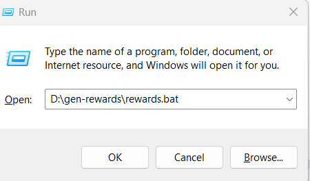

**Project To run/search in windows bing to earn search reward points**

**Installation Guide:**

**Note:** Run cmd with administrator privileges 
1.  Install Chocolatey

        **Link :** https://chocolatey.org/docs/installation
        **Command :**  
            `@"%SystemRoot%\System32\WindowsPowerShell\v1.0\powershell.exe" -NoProfile -InputFormat None -ExecutionPolicy Bypass -Command "[System.Net.ServicePointManager]::SecurityProtocol = 3072; iex ((New-Object System.Net.WebClient).DownloadString('https://community.chocolatey.org/install.ps1'))" && SET "PATH=%PATH%;%ALLUSERSPROFILE%\chocolatey\bin"
2. Install Python

       **Link :** https://community.chocolatey.org/packages/python
       **Command :** `choco install python --pre`
3. Install Selenium

       **Command :** `pip install selenium`

To run the rewards in Run window (WIN + R) and run below command:

    "D:\rewards\rewards.bat" 
        

    Change the path based on the file path
